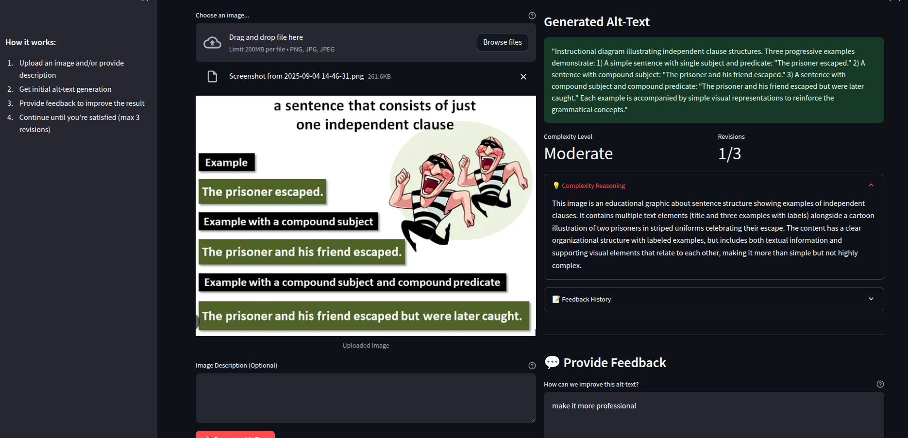

# alt-text-generator

Langgraph based Multi-agent project for generating alt-text.
It contains multiple agents:

Complexity Analysis Agent: Categorizes the input content by complexity (Simple, Moderate, Complex).
Alt-Text Generation Agent: Generates alt-text tailored to the complexity level.
Evaluation & Feedback Agent: That takes the Subject Matter Experts (SMEs) review and correct the generated alt-text to ensure quality and compliance.

This project is structured into Backed/ Langgraph workflow and Streamlit based UI for demonstration
- alt-text-workflow
- alt-text-ui



# Backend setup for Agent core runtime

### Prerequisite
- Python 3
- Basic knowledge of AWS ECR and Agent core runtime
- AWS CLI set up for pushing project image to AWS ECR

### We will be using N. Virginia(us-east-1) region as per Agent Core runtime is currently availablity. 

## To use Amazon Bedrock and models, you need both a **Bedrock API Key** and a **Model ID**.

### Amazon Bedrock Key
1. Go to the **Amazon Bedrock**.  
2. Navigate to **API Keys** under **Discover**.  
3. Generate a new key:  
   - **Short-term** → for temporary testing.  
   - **Long-term** → for production or repeated use.  

### Model Key
1. In the **Amazon Bedrock**, go to **Model Catalogue**.  
2. Select the model you want to use.  
3. Go to **Model Access** and click **Request Access**.  
4. Once your request is approved, you will see the model’s **Inference ID**.  
5. Use this **Inference ID** as your **model key** when calling the API.


## Run on Amazon Bedrock Core Runtime

### 1. Create ECR repository
### 2. Configure AWS CLI with your credentials:
```bash
cd alt-text-generator/alt-text-workflow
aws configure
```
   Provide:
   - AWS Access Key ID  
   - AWS Secret Access Key  
   - Default region (e.g., `us-east-1`)  
   - Output format (`json`, `text`, or `table`)
   Create Pass key:
   - Generate key using: gpg --full-generate-key
   - List keys: gpg --list-keys
   - Select the key using email: pass init "{email_id}"
 
### 3. Authenticate Docker with ECR
```bash
aws ecr get-login-password --region us-east-1 | docker login --username AWS --password-stdin ecr-image-repository
```

Replace **`ecr-image-repository`** with your actual Amazon ECR registry URI, e.g.:  
```
123456789012.dkr.ecr.us-east-1.amazonaws.com
```

### 4. Build and Push Docker Image (ARM64)
```bash
docker buildx build \
  --platform linux/arm64 \
  -t ecr-image-repository-tag \
  --push .
```

- `--platform linux/arm64` → ensures compatibility with AWS Graviton/Bedrock runtime  
- `-t` → tags the image with your ECR repo name and project identifier  
- `--push` → pushes the image directly to ECR  

---

✅ Once pushed, you can use this image in Amazon Bedrock Core Runtime or ECS task definitions.


### 5. Host on Amazon Bedrock Core Runtime
1. Navigate to **Amazon Bedrock AgentCore**  
2. Under **Agent Runtime**, click **Host agent**  
3. Choose **repository** and provide the ECR image URI you pushed in step 4.   
4. Under **Advanced configurations** provide env variables

After setting it up you can test it on AWS testing environment.
Basic testing payload:
```python 
{"user_input": "A group of four engineers in hard hats and safety vests discuss blueprints at a construction site."} 
```

---

## Migrate Existing LangGraph Project to Agent Core Setup

Follow these steps to migrate your existing LangGraph project:

### 1. Initialize the Agent Core App
```python
from bedrock_agentcore.runtime import BedrockAgentCoreApp

app = BedrockAgentCoreApp()
```

### 2. Define a function and annotate as an entrypoint
```python
@app.entrypoint
def invoke_graph(input_data):
    # Your graph invocation logic here
    return {"result": "processed"}
```

### 3. Run the app
```python
app.run()
```

> **Reference:** see `main.py` for a full working example.
